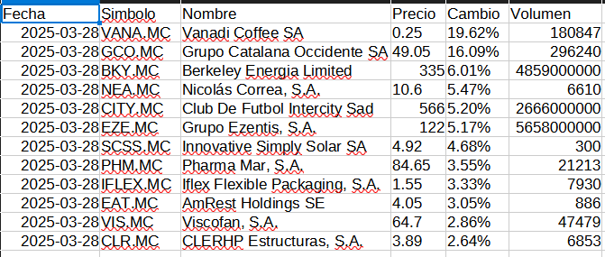

# Mejores Subidas Financieras - Scraper de Yahoo Finance

Script que realiza web scraping a la sección de acciones en crecimiento de Yahoo Finance para extraer las subidas más importantes del día. La información se procesa y se guarda en un archivo CSV que contiene detalles como la fecha, símbolo, nombre, precio, cambio y volumen de cada acción. 

## Tecnologías utilizadas

- **Python**
- **BeautifulSoup**: Para extraer y parsear el HTML.
- **Requests**: Para realizar las peticiones a la web.
- **Pandas**: Para el procesamiento y manipulación de los datos.
- **OS**: Para gestionar la creación de directorios y rutas.

## Funcionamiento

1. **Obtención de datos**:  
   Se realiza una petición HTTP a la página de Yahoo Finance, obteniendo el HTML de la sección de subidas.

2. **Extracción y procesamiento**:  
   Se utiliza BeautifulSoup para buscar las filas de la tabla con información. Cada fila se procesa para extraer:
   - Símbolo de la acción.
   - Nombre de la compañía.
   - Precio actual.
   - Cambio porcentual o absoluto.
   - Volumen de operaciones (con conversión en caso de abreviaturas).

3. **Almacenamiento**:  
   Se crea (si no existe) una carpeta llamada `mejores_subidas` y se guarda un archivo CSV con nombre `subidas_acciones_YYYY-MM-DD.csv` que contiene todos los datos extraídos.

## Instalación y uso
### Requisitos
- Python 3.9 o superior.
- Las siguientes librerías de Python:
  - `beautifulsoup4`
  - `requests`
  - `pandas`

Puedes instalar las dependencias utilizando el archivo `requirements.txt` incluido:
```bash
pip install -r requirements.txt
```
### Ejecución
1.  Clonar repositorio:
    
    ```bash
    git clone https://github.com/m3thod480/scraper-subidas-financieras.git
    cd scraper-subidas-financieras
    
    ```
    
2.  Instalar dependencias:
    
    ```bash
    pip install -r requirements.txt
    
    ```
    
3.  Ejecutar script:
    
    ```bash
    python script-finanzas.py
    
    ```
    

## Ejemplo de resultado

## Notas y consideraciones
    
-   La estructura de la página web puede cambiar en el futuro. Si eso ocurre, es posible que sea necesario actualizar el código de scraping.
    
-   Asegúrate de cumplir con los términos de uso de Yahoo Finance al realizar scraping de su sitio web. La información se procesa y se guarda en un archivo CSV que contiene detalles como la fecha, símbolo, nombre, precio, cambio y volumen de cada acción. 
